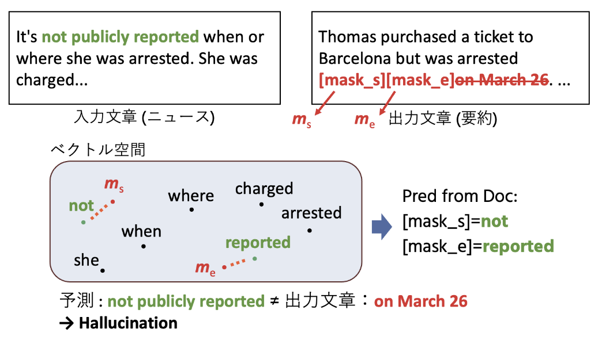

# nlp2026_spandetect
言語処理学会 第32回年次大会で発表した、「[マスク予測モデルを用いた軽量なハルシネーションのスパン検出手法](https://anlp.jp/proceedings/annual_meeting/2026/pdf_dir/B1-19.pdf)」の実装

## data/
実験には[RAGTruthデータセット](https://github.com/ParticleMedia/RAGTruth) (Wu+, 2023) から、QAタスク、要約タスクのものを用いた。
### source_info.jsonl
RAGTruthデータセットの入力文章。(QAタスクでは回答の参考になる文章、要約タスクでは要約前の文章)
### response.jsonl
RAGTruthデータセットの出力文章。(QAタスクでは回答、要約タスクでは要約後の文章)
### ft_{train, dev, test}.jsonl
比較手法を実験するためのデータセット。
主要なフィールドは以下の通り。
| Field name| Field value | Description |
| --- | --- | --- |
| id_name | string | データセット内の一意なID |
|source_id| string | source_info.jsonlのsource_idと対応 |
|task_type| string | "QA" or "Summary" |
|model| string | 出力文章を生成したモデル名(6種類) |
|source_info|dict or string|入力文章。QAタスクの場合は辞書型で、"question"と"passage"をキーに持つ。要約タスクの場合は文字列型で、要約前の文章。|
|response|string|出力文章|
|labels|list[dict]|出力文章中のハルシネーションのスパンのリスト。各スパンは、"start" (スパンの開始文字位置)、"end" (スパンの終了位置)、"text" (スパンのテキスト)、"label_type" (ハルシネーションのタイプ(4種類)) などをキーに持つ辞書型。|
|input_text|string|Llamaにハルシネーションのスパンを予測させるためのプロンプト (RAGTruthに準拠) 。source_infoとresponseを組み合わせて作成されている。|

### 1127_srl_{train, cls, dev, test_hal}.jsonl
提案手法を実験するためのデータセット。
- train: ModernBERTのfine-tuning用のデータセット
- cls: 線形分類器の学習用のデータセット
- dev: 開発データセット
- test_hal: 評価データセット (ハルシネーションを全く含まない文章は除外)
先述のft_{train, dev, test}.jsonlと同様のフィールドに加えて、以下のフィールドがある。
| Field name| Field value | Description |
| --- | --- | --- |
| srl_splits | list[dict] | 出力文章をSRLで分割したスパンのリスト。各スパンは、"start" (スパンの開始文字位置)、"end" (スパンの終了位置)、"text" (スパンのテキスト) 、"sentence_index" (スパンが属する文のインデックス)、"token_span" (スパンが属するトークンの開始位置と終了位置) などをキーに持つ辞書型。|
|sentence_ids| list[int] | 入力文章の各トークンが何番目の文に属するかを示すリスト。|
